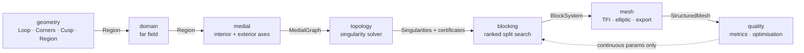

# AeroMesh — Architecture and Build Order

Companion documents: [PROJECT_TRACKER.md](PROJECT_TRACKER.md) for live status
and the decision log, [MAPS_Proposal_v2.md](MAPS_Proposal_v2.md) for the
scientific argument, [MAPS_Implementation_Plan.md](MAPS_Implementation_Plan.md)
for stage-by-stage detail.

**Revised 2026-09-08** after a full review of the first iteration. What changed
and why is in the Decision log of the tracker (D1–D7); the short version is at
the end of this file.

---

## The governing rule

> [!IMPORTANT]
> **Nothing is prescribed.** No hardcoded topology, no domain-type switch, no
> rule table, no per-airfoil or per-configuration branch.
>
> **Derived:** the number of blocks, their connectivity, which boundary arc
> belongs to which block, the number and position of interfaces, the positions
> and types *k* of every singularity, the vertex classification, and the
> topology class itself.
>
> **Supplied:** the geometry of the bodies, where the domain is truncated (a
> distance, or an explicit outer curve), and the target resolution — which
> follows from Re, y⁺ and altitude.

Anything in the first list that is currently an input is a defect. Anything in
the second is a modelling choice, not a topology decision.

The single prescribed construction permitted anywhere is the
midpoint-subdivision template for filling a logically convex *m*-gon (Stage S3).
That is a proven primitive for quad-meshing an *m*-gon — at the level of a
quadratic formula, containing no geometry-specific case — and it must be named
as such where it is used, so it is not mistaken for the thing that was removed.

---

## The data model

A **`Region`** is one outer loop and any number of inner loops. That is the
whole input.

```
Region
├── outer : BoundaryLoop          the truncation curve
└── holes : (BoundaryLoop, ...)   the bodies, any number
```

Each `BoundaryLoop` carries its `Loop` (closed, CCW, uniformly resampled) and
its resolved `Corners` — detected from the geometry, plus any created by opening
a cusp, which are known exactly rather than detected.

This is TopMaker\'s own input model: *a collection of non-intersecting closed
curves*. It subsumes single airfoils, multi-element sections and wing–body
crossflow cuts, and it is why multi-body support costs nothing later.

**There is no `DomainType`.** C, O and H are labels read off the resulting block
graph, never inputs. See D2.

---

## Modules



### `aeromesh.geometry` — the primitives ✅ built

| Module | Contents |
|---|---|
| `loop.py` | `Loop`: closed, CCW, stored open. Arc-length interpolation and corner-preserving resampling, area centroid, containment, rigid transforms. |
| `corners.py` | Scale-invariant C0 detection: extrapolate total turning to zero window width. Returns the corner angle. `fluid_interior_angle` handles the hole/outer convention. |
| `cusp.py` | `open_cusp` cuts perpendicular to the cusp axis and inserts a face of exact length. `find_cusps` gates it. |
| `region.py` | `Region`, `BoundaryLoop`, `prepare_boundary`, `largest_inscribed_circle`. |
| `airfoil.py` | The only module importing AeroShape. Returns a `Loop`, applies no TE policy. |

Why total turning rather than a turn angle over a stencil: for a smooth arc,
turning is exactly linear in the window width, so the extrapolation is exact.
A chord-angle measure saturates at high curvature and reports a NACA leading
edge as a 26° corner — which is precisely the false positive that has to be
avoided.

### `aeromesh.domain` — where to truncate ✅ built

The conventional truncation curves, as explicit constructors. Every one returns
a plain `Loop`.

| Constructor | Corners | Conventional name |
|---|---|---|
| `circle_farfield(bodies, radius)` | 0 | O-type — **the default** |
| `c_farfield(bodies, radius, wake_length)` | 2 | C-type |
| `box_farfield(bodies, upstream, downstream, lateral)` | 4 | H-type, or tunnel walls |
| `offset_farfield(bodies, distance)` | 0 | a distance level set — for tight or widely spread configurations |

**The shape is supplied; the topology is derived.** These are two different
statements and both matter.

*Supplied*: which curve, like how far out to truncate, is a modelling decision.
A circle is geometry, not prescription.

*Derived*: the shape is passed as a curve and stored as a curve. `Region`
records no shape, kind or family, so no later stage can branch on which
constructor made it — an unnamed hand-built curve works identically. Choosing a
C-shaped outer boundary does not select a "C topology".

What the choice *does* influence is how many corners the fluid boundary has, and
a corner generates a medial flare, and a flare generates a block. *Measured* on
a NACA 2412: circle 0 flares, C-shape 2 (the downstream pair; its arc joins the
straight sides tangentially), box 4. That is the mechanism behind the familiar
ring-plus-four-blocks topology, and it is why the default must not be
corner-free by accident. See D8.

`offset_farfield` keeps its place for tight domains and widely spread bodies,
where a circle large enough to contain everything wastes cells. Note that
offsetting a union of *separated* bodies leaves a concave crease where the
nearest-body branch switches — a real corner from an arbitrary choice — so it
offsets the convex hull by default (`hull=True`). Measured on a main-plus-flap
pair at 3 chords: a −20.9° crease with `hull=False`, none with the default.

### `aeromesh.medial` — the two skeletons ✅ built

Two entry points, `interior_axis(loop)` and `exterior_axis(region)`, both
returning a graph carrying **r_m, θ_m, n̂₁, n̂₂, touch points and arc length s**
on every medial point. The first iteration computed none of these, which is why
the topology stage had nothing but node degree to work with.

**Why two.** The exterior axis of a far-field domain is scale-dominated: with the
boundary at ten chords, θ_m over the whole medial loop measures 172.9°–180.0°,
so Fogg's index n = round((π − θ_m)/(π/2)) is zero everywhere. The loop is
featureless. The body's *interior* axis is scale-free and carries the shape:
θ_m ≈ 70° at the leading-edge dangle (n = 1, a nose singularity) against 180° at
mid-chord (n = 0), identically for 0012, 2412 and 8412.

**Membership is geometric, and the unit is the smooth boundary element, not the
loop.** A ridge is medial when its generators lie on different elements, or far
enough apart on the same one. A C0 corner divides a loop into elements, so
`Region.segment_ids()` derives the segmentation from detected geometry. That is
the same idea the first iteration reached for with its upper/lower "macro
curves" — but split at the minimum-x sample, a parameterisation artefact, which
is what invented a branch of radius zero at every leading edge.

**Accuracy comes from measuring to the polyline, not to the samples.** Both
r_m and the touch points are exact feet on the boundary segments, which makes
θ_m second order; a flare tip additionally takes θ_m = π − α analytically from
the corner angle, because there both touch points converge and the measurement
is decided by the last surviving Voronoi vertex. Against closed form: annulus
r_m to 0.0021% and θ_m to 180.000°, ellipse half-extent to 0.046%, θ on a 90°
flare exactly 90.0000° across a 5000× range of scales.

**Finite contact is built deliberately.** An exact circle's medial axis is a
single point and a discrete Voronoi returns an empty graph. The vertex is
emitted explicitly with its max θ_m = 180°, which is what Fogg's
k = −⌊max θ_m/(π/2)⌋ = −2 consumes.

**No wake branch, and that is correct.** The medial axis terminates at convex
corners of the *fluid domain* — the far-field corners, which give flares. A
convex corner of a *body* is reflex for the fluid, where the corner is the
unique nearest point for a fan of directions, so nothing emanates. A circular
far field around an airfoil gives a bare ring. The wake cut is a decomposition
split from a reflex corner (Fogg §4.1), which is S3. See D9.

### `aeromesh.topology` — solve, do not look up ⬜ S2

The singularity field is the **solution** of a flux balance, evaluated only at
the three positions where an imbalance can occur (Fogg §3.5): θ_m crossings of
π/4 and 3π/4, medial vertices, and concave-corner switch points. At finite
contact, k = −⌊max θ_m/(π/2)⌋; at boundary corners, n_c from the fluid interior
angle. Nearby singularities merge within a **local** tolerance of [r_m/4, r_m],
so a fuselage and an airfoil in one domain each get their own scale.

TopMaker\'s rule table — primary edge gives two block faces, flare one, dangle
five — is **not implemented**. Fogg\'s paper exists because it fails: it assumes
all corners are flat except those on flares, which distorts blocks on a
multi-element aerofoil. See D3.

**Two certificates, both cheap, both before construction.**

- *Retract*: b₁ of the medial graph must equal the number of bodies, because the
  medial axis deformation-retracts onto the fluid region. Measured exact across
  one, two and three bodies, an airfoil-plus-fuselage pair, a lone fuselage and
  a circle.
- *Index budget*: Σkᵢ constrained by χ = 1 − h, as a cross field on a surface
  must satisfy Gauss–Bonnet. It scales with body count for free. The annulus case
  is a first confirmation — χ = 0, budget zero, n = 0 measured everywhere.
  Pinning the exact constant per boundary convention is real work.

### `aeromesh.blocking` — a ranked search ⬜ S3

Candidate splits are curves of the medial coordinate system: constant-s lines
(medial radii, the spokes) and constant-ρ level sets with ρ = d_wall/r_m (the
ring interfaces). A medial radius meets the boundary perpendicularly by
definition, so **wall orthogonality is by construction**.

Splits are ranked with n = 0 preferred over n = 1, and medial angles nearer π
and π/2 favoured within each; a singularity is fixed into a block corner only
when no permitted split exists.

### `aeromesh.mesh` — construction ⬜ S4

TFI per block, then Thompson–Thames–Mastin elliptic smoothing with wall spacing
imposed as a boundary condition, tanh clustering from Δy₁, r and N_wall, export
through `meshio`. Both algorithms are classical and both references are in
`PAPER/references`. The current `algebraic.py` returns zero arrays and
`smoothing.py` returns its input.

### `aeromesh.quality` — metrics and optimisation ⬜ S6

Wall orthogonality, minimum Jacobian, boundary-layer aspect ratio, metric jump
across interfaces, achieved y⁺; cross-checked against `vtkMeshQuality`.

The design vector is no longer degenerate. Interface arc-lengths sᵢ along the
exterior loop have no gradient (θ_m is flat there); the ring offset ρ* does. What
remains is a handful of smooth continuous parameters — ρ*, Δy₁, r, N_wall — which
is L-BFGS territory in tens of evaluations, not CMA-ES over a thousand.

---

## Build order

Full detail, gates and estimates in [PROJECT_TRACKER.md](PROJECT_TRACKER.md).

| Stage | Scope | Status |
|---|---|---|
| **S0** | Loop, corners, cusp policy, Region, far field | ✅ done 2026-09-08 |
| **S1** | Medial engine | ✅ done 2026-09-08 |
| **S2** | Singularity solver and certificates | 🔨 next |
| **S3** | Decomposition | ⬜ |
| **S4** | Mesh construction | ⬜ |
| **S5** | Adversarial geometry gate | ⬜ |
| **S6** | Quality and optimisation | ⬜ |
| **S7** | Bunin φ-field by FEM — optional | ⬜ |

> [!WARNING]
> **S0 → S1 → S2 → S3 is not negotiable.** The hardcoded blocking in the first
> iteration appeared because S3 was attempted while S1 was incomplete and S2 did
> not exist. If the singularity solver cannot yet tell an O-topology from a
> C-topology on a bare skeleton, the decomposition stage has nothing to
> decompose against and a template is the only thing that will run.

---

## What changed in this revision

| Was | Now | Why |
|---|---|---|
| `Boundary` (one airfoil) + `DomainType` (C/O/H) | `Region` = outer loop + N holes | C/O/H were an input that switched the blocking — prescription at the top of the pipeline. Multi-body becomes free. **D2** |
| Closed TE only; blunt TE out of scope | Blunt is the default; closed and cusped supported by explicit corner seeding | A cusp is the degenerate case for a medial axis and the wake branch cannot be recovered from a Voronoi. **Reverses the earlier decision. D1** |
| TopMaker rules as the blocking method | Flux balance solves; a ranked search decomposes | The rule table is what Fogg\'s paper is a critique of. **D3** |
| Far field selected by letter, which also switched the blocking | Far field is a curve, built by an explicit constructor; circle by default | Separates the two things the letter used to do. The curve is a supplied modelling input; the topology is derived from its corners. **D4, superseded by D8** |
| Phase D: physics-informed DeepONet | Cut from the critical path; Bunin φ kept as an optional FEM stage | Topology is solved and certified rather than searched, so the surrogate is a fast answer to a problem that no longer exists. **D5** |
| Phase A marked *done* and *strictly validated* | S0 done; the rest open | θ_m, n̂, the touch-point map and angle-based pruning did not exist. The suite passed 34 shape assertions while the skeleton carried branches of radius zero. **D6** |

---

## Reuse from AeroShape

| Need | API | Used in |
|---|---|---|
| Airfoil points | `AirfoilProfile.from_naca4/5/cst/parsec/dat_file` | `geometry/airfoil.py` |
| Wall-normal clustering | `aeroshape.analysis.clustering` | S4 |
| CST random sections | `AirfoilProfile.from_cst` | S5 randomised gate |
| B-spline basis | `geomdl` / AeroShape NURBS | 3-D extension |

The dependency is one-directional and confined to a single module. AeroMesh
re-implements no geometry handling.
